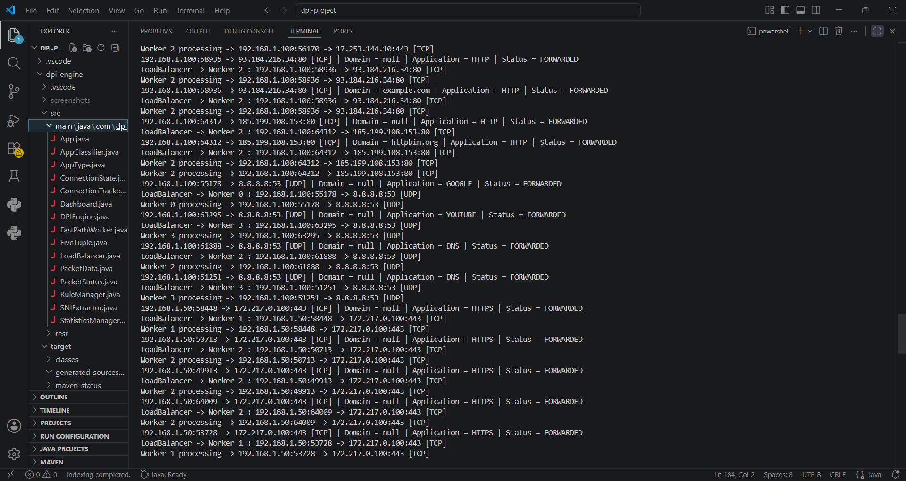
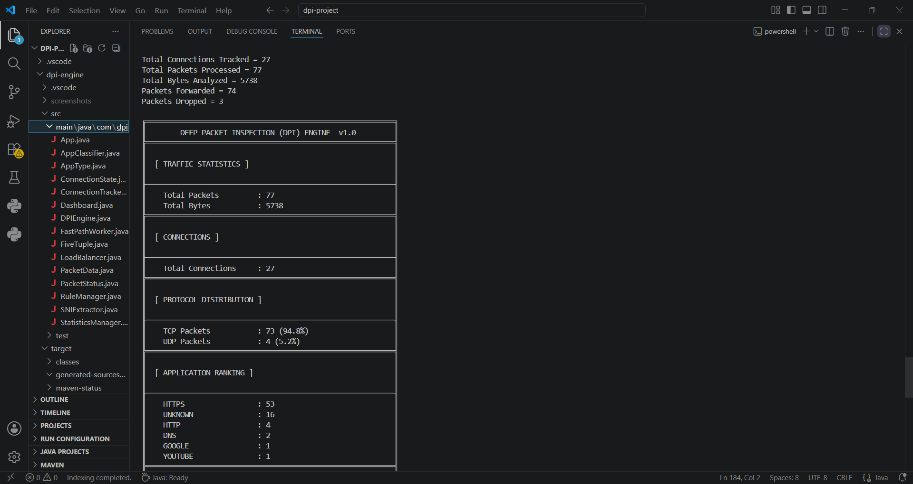

# Deep Packet Inspection (DPI) Engine

## Overview

A Java-based Deep Packet Inspection (DPI) Engine that analyzes network traffic from PCAP files, classifies applications, tracks connections, applies firewall rules, distributes traffic across worker threads, and generates detailed traffic analytics.

## Features

- PCAP File Processing
- TCP/UDP Packet Analysis
- Five Tuple Extraction
- Deep Packet Inspection (DPI)
- TLS SNI Extraction
- Application Classification
- Connection Tracking
- Firewall Rule Engine
- Multi-threaded Processing
- Load Balancing
- Traffic Analytics Dashboard
- Top Source/Destination IP Analysis
- Domain Analysis
- Worker Performance Monitoring

## Technologies Used

- Java 17
- Maven
- Pcap4J
- Multi-threading
- Concurrent Queues

## Architecture

text
PCAP File
    │
    ▼
Packet Parser
    │
    ▼
Connection Tracker
    │
    ▼
DPI Engine
    │
    ├── Application Classification
    ├── SNI Extraction
    ├── Firewall Rules
    │
    ▼
Load Balancer
    │
    ▼
Worker Threads
    │
    ▼
Statistics Manager
    │
    ▼
Dashboard Report

## Dashboard Screenshots

### Dashboard Overview

### Application Analysis

### Network Analysis

### Performance Analysis

## Project Structure

text
src/main/java/com/dpi
├── App.java
├── DPIEngine.java
├── FastPathWorker.java
├── LoadBalancer.java
├── ConnectionTracker.java
├── RuleManager.java
├── StatisticsManager.java
├── Dashboard.java
├── PacketData.java
├── FiveTuple.java
├── AppClassifier.java
└── SNIExtractor.java

## Build and Run

### Compile Project

bash
mvn clean compile

### Run Application

bash
mvn exec:java

## Sample Output

text
Total Connections Tracked = 27
Total Packets Processed = 77
Total Bytes Analyzed = 5738
Packets Forwarded = 74
Packets Dropped = 3

HTTPS   : 53
UNKNOWN : 16
HTTP    : 4
DNS     : 2
GOOGLE  : 1

## Key Concepts Demonstrated

- Deep Packet Inspection (DPI)
- Network Traffic Analysis
- Multi-threaded Processing
- Concurrent Programming
- Load Balancing
- Firewall Rule Engine
- Connection Tracking
- Application Classification
- TLS SNI Extraction
- Packet Parsing
- Traffic Analytics
- Performance Monitoring

